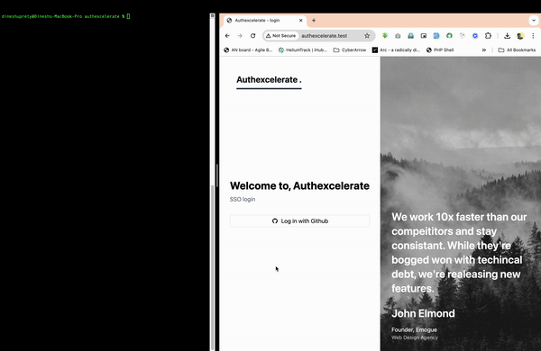

"Any fool can write code that a computer can understand. Good programmers write code that humans can understand.” –
Martin Fowler"

# Authexcelerate

The name Authexcelerate merges authentication (Auth), Excel export (Excel), and efficiency (Accelerate). It represents a
Laravel project that adeptly manages user authentication through GitHub OAuth and empowers authenticated users to upload
JSON files, subsequently exporting them to Excel format.

## Demo



## Installation

Begin by cloning the project repository:

```bash
git clone https://github.com/dineshuprety/authexcelerate.git
```

After cloning the repository, navigate to the project folder:

```bash
cd authexcelerate
```

This command will take you to the directory where the project has been cloned, allowing you to proceed with the next
steps for setting up and running the project.

# Run the project

Create a file named ".env" and copy the contents of ".env.example" into it. Adjust the following parameters:

```bash
DB_DATABASE=
DB_USERNAME=
DB_PASSWORD=
```

Ensure that Composer is installed on your device.
Run the following commands:

Run Command :

```bash
composer install
php artisan migrate
```

# Usages

This project utilizes Laravel packages `laravel/socialite` and `maatwebsite/excel`. During Excel exportation, it's
essential to run the queue:

```bash
php artisan q:work
```

By adhering to these steps, you can efficiently run and utilize the Authexcelerate project.
